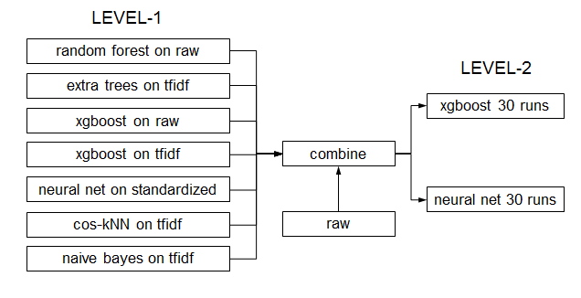
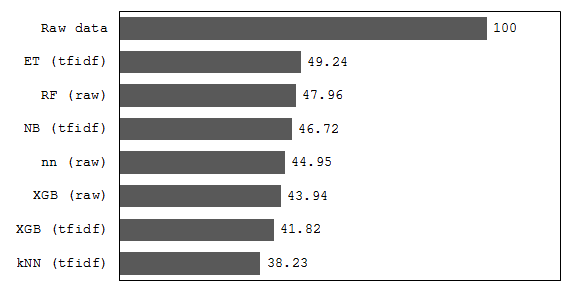

Title: My solution to Kaggle's Otto Group Challenge
Date: 2015-08-03 01:53:09
Modified: 2015-08-03 01:53:09
Category: kaggle
Tags: kaggle, ensembling, xgboost, lasagne, nolearn
Authors: tester, mult1vac
Status: published
Summary:  This solution is for Kaggle's Otto Product Classification competition. The competition's goal was to classify items into 9 product categories based on 93 anonymous count features. I recently handed on this competition for practice purposes. Before this, I played with some kaggle 101 games like Julia, Titanic, etc. My personal goal in doing this was to learn how to tackle on a real kaggle challenge.

This solution is for Kaggle's **[Otto Product Classification competition][1]**. The competition's goal was to classify items into 9 product categories based on 93 anonymous count features. I recently handed on this competition for practice purposes. Before this, I played with some kaggle 101 games ([Julia][2], [Titanic][3], etc). My personal goal in doing this was to learn how to tackle on a real kaggle challenge.

My final model ran 0.41922 on private LB. It was built in two levels using stacking. Predictions in the first level were treated as meta features and were combined with raw data to feed into the second level, known as meta learner. The architecture is given below. Next I will go through the single models I've tried in level 1 then the ensembling methods in level 2.

<!--more-->

<!-- 



 -->

## Single Models

### Random Forest

Random forest is always the first choice in kaggle's classification problems. It's unpicky, fast and guarantees a fairly good result. Extra trees is another good choice to start with. I tried RF and ET on raw data and ti-idf transformed data by 5-fold CV. The best models I got were:

* RF with 500 trees on raw: `0.56587 (public LB), 0.56665 (private LB)`
* ET with 500 trees on tfidf: `0.57092 (public LB), 0.57599 (private LB)`

***Notice:*** *I didn't do much feature engineering in this game, mainly because features were anonymous. The tfidf idea was raised in the forum and improved the whole result a little bit.*

### Probability Calibration

Random forest (or ET) is not good at predicting probabilities bacause it doesn't directly optimize the log-loss, but this could be fixed by probability calibrating. Using sklearn's **[CalibratedClassifierCV][4]** with default settings, I got big improvements:

* RF with 500 trees on raw: `0.47665 (public LB), 0.47881 (private LB)`
* ET with 500 trees on tfidf: `0.46122 (public LB), 0.46487 (private LB)`

### Gradient Boosting

I tried **[XGBoost][5]** for the first time. It's multi-threaded and very fast. I manually tuned the hyperparameters using early stopping. Problem related hyperparameters were well discussed in the forum (for reference, check [this][7]). Best models were:

* Single xgb on raw: `0.45780 (public LB), 0.45768 (private LB)`
* Average of 20 xgbs on raw: `0.43941 (public LB), 0.43987 (private LB)`

### Nearest Neighbors

I tried different metrics (euclidean, cosine, correlation) on different engineered data sets (raw, 0-1 standardization, PCA, tf-idf) with different k. The best model I got was:

* k=300 cosine similarity on tf-idf: `0.68294 (public LB), 0.69121 (private LB)`

### Neural Net

I trained neural nets with two hidden levels using Theano, Lasagne and Nolearn. Tried PCA and tfidf transformation with no success. It seemed feature engineering didn't help here in neural nets. The best model was:

* 2-hidden-level nn on raw: `0.46946 (public LB), 0.47102 (private LB)`

***Digression:*** *Theano seemed impossible to be installed on windows but could be easily installed on linux.*

### Naive Bayes

By the intuition the 93 features might be word counts, I tried naive bayes by sklearn's [MultinomialNB][8] on tfidf and raw. NB was really easy and fast and the best result was:

* NB on tfidf: `0.79851 (public LB), 0.80344 (private LB)`

## Ensembling

### Stacking

First I tried to averaging all the above models. With public 0.49448 and private 0.49561 LB scores it didn't help at all. I was inspired by Mike Kim's **[meta bagging method][9]** and built my stacking model.

The main approach was as follows:

* **Step 1:** Split the training set into two disjoint sets: l1-training set and l2-training set.
* **Step 2:** Train base learners using l1-training set.
* **Step 3:** Run base learners on l2-training set, get predictions as meta features.
* **Step 4:** Combine step 3's meta features with l2-training features as input, l2-training set's label as output, train the 2nd level model.

I chose base learners from above models. Calibrated forests were omitted because of severe memory consuming. Although single knn and naive bayes didn't perform very well, they were chosen to add different bias into level 1. Level 1 produced 63 `(9 * 7)` meta features, and were combined to the original 93 features into level 2.

Since xgb and neural net use softmax to directly optimize log-loss, they performed well as a 2nd level model. Due to limited time I only tried some l1:l2 split ratio, and chose 1:1 split due to the best result.

### Results

A single run of the whole approach gave:

* XGB as meta learner: `0.45595 (public LB), 0.45923 (private LB)`
* 2-hidden-level nn as meta learner: `0.46373 (public LB), 0.46812 (private LB)`

Averaging 30 runs of this approach gave:

* XGB as meta learner: `0.42492 (public LB), 0.42727 (private LB)`
* 2-hidden-level nn as meta learner: `0.43257 (public LB), 0.43513 (private LB)`

Combining xgb and nn by averaging gave:

* Stacking: `0.41777 (public LB), 0.41922 (private LB)`

Base learners' importance can be estimated by xgb's feature importance. I drew the relative model importance map below. It looks like the meta features did a good contribution to the result.

<!-- 



 -->

## Conclusion

Due to limited time and poor skills of mine, I didn't polish my model to satisfaction. And some methods I'd love to try yet didn't use in this game are:

* Weighted averaging tuning
* Automatic hyperparameter tuning using tools like [hyperopt][11]

The code can be found **[here][10]** on my Github.

## Reference

* [Wolpert's Stacked Generalization (Stacking)](http://www.machine-learning.martinsewell.com/ensembles/stacking/)
* [Starting Guide with Lasagne](https://www.kaggle.com/c/otto-group-product-classification-challenge/forums/t/13016/neural-nets-in-sklearn/68544#post68544)
* [Understanding XGBoost Model on Otto Dataset](https://www.kaggle.com/tqchen/otto-group-product-classification-challenge/understanding-xgboost-model-on-otto-data)

[1]: https://www.kaggle.com/c/otto-group-product-classification-challenge 
[2]: https://www.kaggle.com/c/street-view-getting-started-with-julia
[3]: https://www.kaggle.com/c/titanic
[4]: http://scikit-learn.org/stable/modules/generated/sklearn.calibration.CalibratedClassifierCV.html#sklearn.calibration.CalibratedClassifierCV
[5]: http://scikit-learn.org/stable/modules/generated/sklearn.ensemble.GradientBoostingClassifier.html
[6]: https://github.com/dmlc/xgboost
[7]: https://www.kaggle.com/c/otto-group-product-classification-challenge/forums/t/14303/0-416-in-just-a-few-lines-of-code
[8]: http://scikit-learn.org/stable/modules/generated/sklearn.naive_bayes.MultinomialNB.html#sklearn.naive_bayes.MultinomialNB
[9]: https://www.kaggle.com/c/otto-group-product-classification-challenge/forums/t/14295/41599-via-tsne-meta-bagging/79084#post79084
[10]: https://github.com/apex51/kaggle-otto-group
[11]: http://hyperopt.github.io/hyperopt/